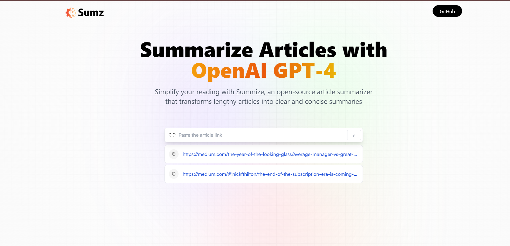

# AI Summariser - React + Vite

This template provides a minimal setup to get React working in Vite with HMR (Hot Module Replacement) and some ESLint rules.

**Official Plugins:**

- [@vitejs/plugin-react](https://github.com/vitejs/vite-plugin-react/blob/main/packages/plugin-react/README.md): Uses [Babel](https://babeljs.io/) for Fast Refresh.
- [@vitejs/plugin-react-swc](https://github.com/vitejs/vite-plugin-react-swc): Uses [SWC](https://swc.rs/) for Fast Refresh.

## About

AI Summariser is an open-source article summarization tool that simplifies your reading experience. It transforms lengthy articles into clear and concise summaries. Just paste the article link into the search bar, and it will generate a summary for that article.

This Website is **Fully Responsive** on all screen sizes

**Key Features:**

- Modern User Interface
- Fully Responsive Design using Tailwind CSS
- Connection to OpenAI's GPT Model
- Integration of Redux Toolkit Query
- Copy to Clipboard
- Browser History Storage
- Fully Responsive 

## Tech Stack

- ReactJS
- Vite
- Javascript
- Tailwind CSS
- Redux Toolkit Query (RTK)
- OpenAI's API through Rapid API

## Getting Started

To get started with AI Summariser, follow these steps:

1. Clone the repository: `git clone https://github.com/aryan-prog/ai_summariser.git`
2. Install dependencies: `npm install`
3. Run the development server: `npm run dev`
4. Open your web browser and navigate to `http://localhost:3000`

## Usage

1. Paste the URL of the article you want to summarize into the search bar.
2. Click the "Summarize" button.
3. The application will generate a summary of the article for you.
4. You can use the "Copy to Clipboard" feature to easily save or share the summary.

## Live Demo

Experience the live version of the AI-Summarizer at [Live Demo](https://ai-summarizer-23.netlify.app/).

## Motivation

This project serves as a testament to my passion for web development and showcases my ability to combine creativity with technical skills to create a visually captivating and functional portfolio.

## Contributing

Contributions to AI Summariser are welcome! If you have any ideas, suggestions, or improvements, please feel free to open an issue or submit a pull request.

The **AI Summarizer** exemplifies my dedication to presenting my skills and experiences in a creative and engaging manner. I hope this project provides a comprehensive and impressive representation of my capabilities as a software developer. Thank you for visiting my portfolio website! If you have any questions or would like to get in touch, please feel free to contact me at [seth.aryan605@gmail.com](mailto:seth.aryan605@gmail.com). Happy coding!
